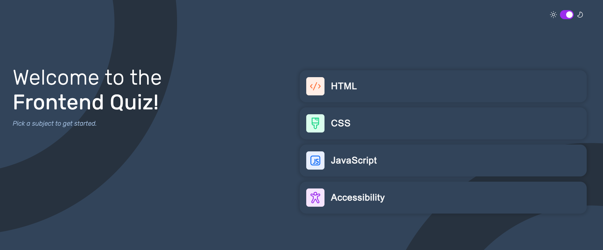

# Frontend Mentor - Quiz app solution

## Table of contents

- [Frontend Mentor - Quiz app solution](#frontend-mentor---quiz-app-solution)
  - [Table of contents](#table-of-contents)
  - [Overview](#overview)
    - [The challenge](#the-challenge)
    - [Screenshot](#screenshot)
    - [Links](#links)
  - [My process](#my-process)
    - [Built with](#built-with)
  - [Author](#author)

## Overview

### The challenge

Users should be able to:

- Select a quiz subject
- Select a single answer from each question from a choice of four
- See an error message when trying to submit an answer without making a selection
- See if they have made a correct or incorrect choice when they submit an answer
- Move on to the next question after seeing the question result
- See a completed state with the score after the final question
- Play again to choose another subject
- View the optimal layout for the interface depending on their device's screen size
- See hover and focus states for all interactive elements on the page
- Navigate the entire app only using their keyboard
- **Bonus**: Change the app's theme between light and dark

### Screenshot

### Links

- Solution URL: [Repository hosted on GitHub](https://github.com/ejparnell/frontend-quiz-app)
- Live Site URL: [Site hosted on Netlify](https://regal-cuchufli-50213d.netlify.app/)

## My process

### Built with

- Semantic HTML5 markup
- CSS custom properties
- Flexbox
- CSS Grid
- Mobile-first workflow
- [React](https://reactjs.org/) - JS library
- [Vite](https://vitejs.dev/) - Build tool
- [Styled Components](https://styled-components.com/) - For styles

## Author

- Website - [Beth Parnell](https://www.your-site.com)
- LinkedIn - [@elizabethjparnell](https://www.linkedin.com/in/elizabethjparnell/)